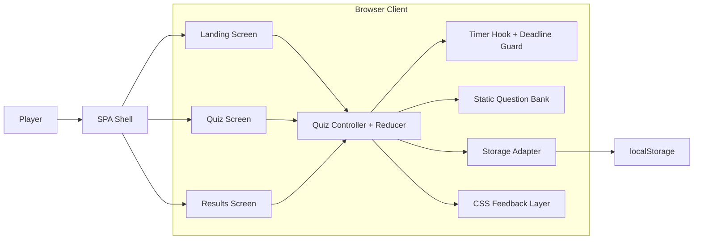
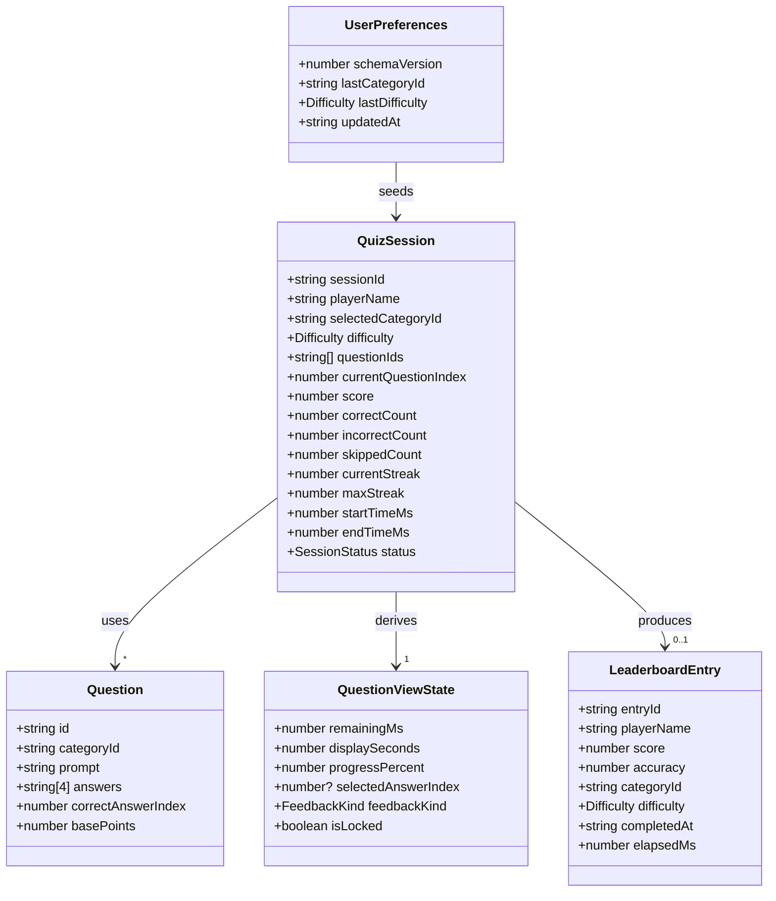
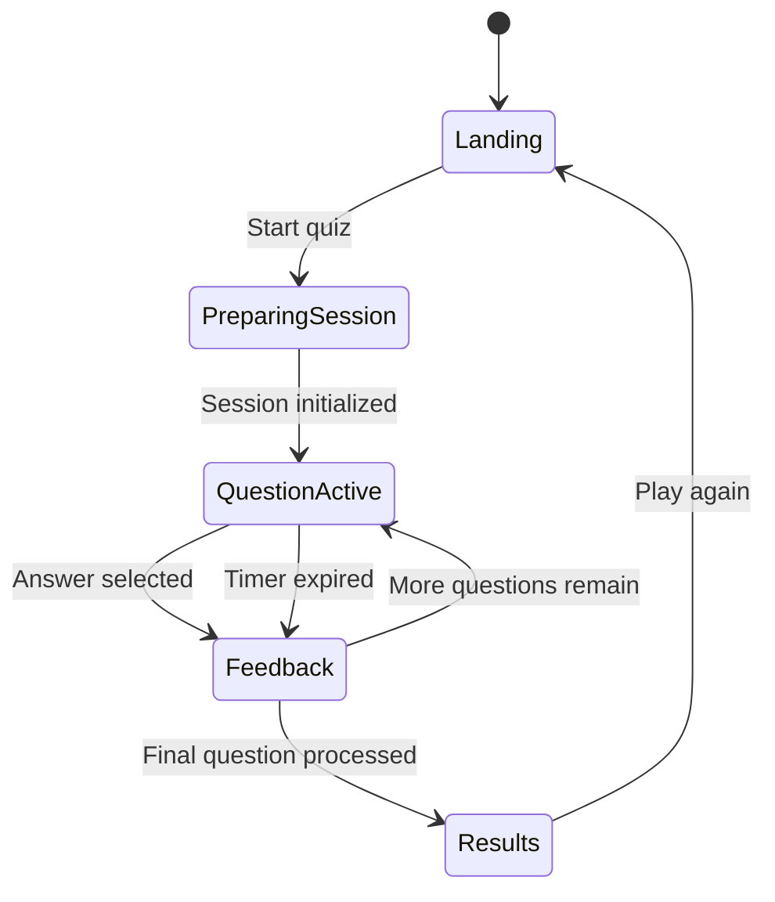
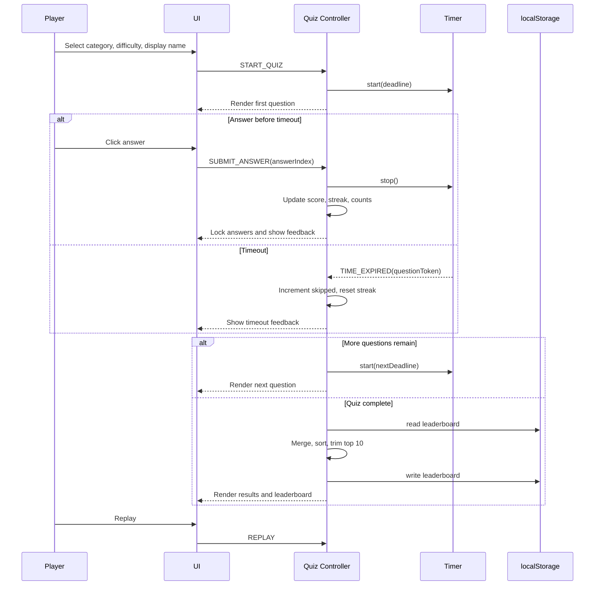

# Technical Design Specification: Quiz Web App

## 1. Title and Document Control

| Field | Value |
|---|---|
| Document title | Technical Design Specification: Quiz Web App |
| Version | 1.0 |
| Status | Proposed |
| Author role | Senior Solution Architect / Senior Agentic Engineer |
| Last updated | 2026-04-07 |
| Source PRD | [quiz-web-app-prd.md](/Users/luannh/Documents/projects/claude-code-homework/docs/quiz-web-app-prd.md) |

## 2. Executive Overview

### System Summary
Build a client-only single-page quiz application that runs entirely in the browser, presents one timed multiple-choice question at a time, scores answers in real time, and finishes with a results summary plus a persistent local leaderboard.

### Primary Goals
- Deliver a polished, reviewable frontend coding exercise.
- Provide a fast quiz loop with clear feedback, visible progress, and replay value.
- Demonstrate strong client-side state management, browser timing, and `localStorage` usage.
- Meet the PRD accessibility and performance targets on desktop and usable mobile widths.

### Key Product Constraints
- No backend, no external APIs, no cloud sync.
- Exactly four answer buttons per question.
- Category and difficulty selection must exist on the landing screen.
- Timer duration must be `20s / 15s / 10s` for `Easy / Medium / Hard`.
- Leaderboard must persist top 10 entries in `localStorage`.
- Core screens are landing, quiz, and results.
- Prefer in-memory screen switching over full routing.

### Non-Goals Carried Forward
- Multiplayer gameplay.
- Server-backed accounts or leaderboards.
- Admin tools or question authoring.
- Social, chat, or rewards features.
- Adaptive difficulty.
- Native mobile packaging.

## 3. Requirements Mapping

### Functional Requirements Summary

| ID | Requirement |
|---|---|
| FR-1 | Start from a landing screen with category and difficulty selection. |
| FR-2 | Present one question at a time with exactly four answer buttons. |
| FR-3 | Start and reset a per-question timer automatically. |
| FR-4 | Auto-skip unanswered questions on timeout. |
| FR-5 | Show running score, streak behavior, and progress during play. |
| FR-6 | Show immediate answer feedback, then advance automatically. |
| FR-7 | Show final results with score, counts, accuracy, category, difficulty, and elapsed time. |
| FR-8 | Persist and display a local top-10 leaderboard after completion. |
| FR-9 | Support at least 10 total questions across at least 2 categories. |

### Non-Functional Requirements Summary

| ID | Requirement |
|---|---|
| NFR-1 | Desktop Lighthouse Performance and Accessibility scores of at least 90. |
| NFR-2 | Works in latest Chrome, Safari, and Edge. |
| NFR-3 | Results screen renders within 1 second after quiz completion. |
| NFR-4 | Timer display updates at least once per second without visible lag. |
| NFR-5 | UI remains usable down to 320px width. |
| NFR-6 | All core interactions are keyboard accessible and not color-only. |
| NFR-7 | `localStorage` data must be validated and malformed entries handled safely. |

### Traceability Table

| PRD Requirement | Technical Implication | Technical Design Response |
|---|---|---|
| Category and difficulty selection on landing | Need pre-game configuration state | Landing screen owns validated `StartQuizInput`; preferences prefill last used values |
| One question at a time, four buttons | Need deterministic single-question rendering | Quiz screen renders one `QuestionCard` with four `AnswerButton` components only |
| Timer per question with difficulty mapping | Need centralized timer rules and reset safety | Difficulty-to-seconds constants in game engine; timer hook keyed by question token |
| Auto-skip on zero | Need timeout transition that cannot double-submit | Reducer handles `TIME_EXPIRED` with lock guard and skip side effects |
| Running score visible and updated after each question | Need pure scoring module | `scoring.ts` returns awarded points, multiplier, updated streak, and counts |
| Streak multipliers after 3 and 5 correct answers | Need precise order-of-operations definition | Increment streak first on correct answer, then apply `2x` at streak `3-4` and `3x` at `5+` |
| Progress bar updates after each question | Need completed-question derived value | Progress derived from `correct + incorrect + skipped` over `totalQuestions` |
| Feedback animations within 300ms | Need lightweight render-safe animation layer | CSS transitions on answer states using transform/opacity/color tokens |
| Results screen shows score, counts, accuracy, difficulty, category, elapsed time | Need immutable session summary object | `QuizSessionSummary` derived on final transition and rendered by results screen |
| Top-10 leaderboard in `localStorage` | Need versioned persistence adapter | `leaderboardStorage.ts` validates, sorts, trims, and writes schema version `v1` |
| No backend | Need all data bundled locally | Static question bank module and browser-only storage |
| Desktop and mobile widths, keyboard accessible | Need responsive, semantic UI | Single-column mobile-first layout, semantic buttons, visible focus, non-color feedback |

## 4. Proposed Architecture

The application should use a small client-side architecture with explicit domain boundaries and no unnecessary framework layers. The browser hosts one SPA shell. The shell switches between three screen states in memory. A reducer-driven game controller owns all quiz logic. Dedicated helper modules handle timer calculation, scoring, validation, and persistence.

### Major Layers

| Layer | Modules | Responsibility |
|---|---|---|
| UI / Presentation | `LandingScreen`, `QuizScreen`, `ResultsScreen`, shared components | Render screens, capture input, display feedback and leaderboard |
| State / Game Engine | `quizReducer`, action creators, selectors | Manage lifecycle, scoring, streaks, progress, and final summary |
| Timer Handling | `useQuestionTimer`, deadline utilities | Start, stop, reset, and guard per-question countdown behavior |
| Question Data | `questionBank`, validators | Provide category-filtered static questions and validate schema at startup |
| Persistence | `leaderboardStorage`, `preferencesStorage` | Read, validate, normalize, and write browser storage safely |
| Feedback / Animations | CSS state classes, reduced-motion rules | Show correct/incorrect/timeout feedback without blocking logic |
| Testing | Pure domain tests, UI integration tests | Prove deterministic logic and end-to-end quiz progression |

### Why This Fits a Client-Only SPA
- It keeps all domain logic in pure functions and reducer transitions, which makes the exercise easy to review and test.
- It avoids routing, external state libraries, and backend abstractions that the PRD does not require.
- It isolates the highest-risk concerns: timer correctness, storage safety, and double-submit prevention.
- It supports fast results rendering because all compute and persistence stay local and synchronous.
- It matches the PRD preference for simple in-memory view switching.

### High-Level Architecture Diagram



## 5. Technology Decisions

| Area | Recommended Choice | Rationale | Rejected Alternative |
|---|---|---|---|
| Frontend framework | React + TypeScript | Strong component model, reducer ergonomics, review familiarity, safer state transitions | Vanilla JS is viable but adds more manual DOM and event coordination for a timer-heavy exercise |
| Build tooling | Vite | Fast local startup, minimal config, strong TypeScript support | CRA adds unnecessary legacy overhead |
| Routing | No router; in-memory screen enum | Matches PRD preference and keeps flow simple | React Router adds complexity without navigation requirements |
| State management | `useReducer` + domain helpers | Explicit transitions, no extra dependency, testable pure logic | Redux/Zustand/XState are unnecessary for three screens and a single state machine |
| Styling | CSS Modules + CSS custom properties | Scoped styles, easy animations, good readability, minimal config | Tailwind is workable but adds utility churn and config overhead for a small exercise |
| Timer implementation | Deadline-based timer hook using `Date.now()` plus a short interval | Prevents drift better than decrement-only counters; simple to reason about | `requestAnimationFrame` is accurate but unnecessary for a once-per-second display |
| Persistence | `localStorage` with schema validation and versioned keys | Exact PRD fit, simple, synchronous, local only | IndexedDB is overkill for small top-10 datasets |
| Testing | Vitest + React Testing Library + `user-event` | Fast feedback, strong unit and integration support in one toolchain | Cypress/Playwright as primary tool is heavier than needed for this exercise |
| Linting / quality | ESLint + TypeScript strict mode | Prevents state and null-safety bugs early | Non-strict TypeScript increases ambiguity in domain logic |
| Audio | Omit from MVP | PRD marks audio as optional; not required to satisfy goals | Web Audio API in MVP increases polish cost without improving core acceptance coverage |

### Primary Stack Recommendation
React, TypeScript, Vite, CSS Modules, `localStorage`, Vitest, React Testing Library, and strict schema validation utilities provide the best balance of implementation speed, reviewability, and deterministic behavior for this coding exercise.

## 6. System Components and Responsibilities

| Component / Module | Responsibilities | Inputs | Outputs | Dependencies | Failure Cases |
|---|---|---|---|---|---|
| `AppShell` | Own global screen state and boot validation | Valid question data, preferences | Active screen and props | Question validators, preferences storage | Invalid boot data |
| `LandingScreen` | Capture category, difficulty, optional display name | Categories, saved preferences | `START_QUIZ` payload | UI components | Missing category, invalid difficulty |
| `QuizScreen` | Render current question, timer, score, progress, feedback | Current question view model | Answer or timeout events | Timer hook, shared components | Double clicks, stale timer |
| `quizReducer` | Execute quiz state transitions | Current state, action | Next state | Scoring, selectors | Inconsistent action order |
| `scoring` | Calculate awarded points, streaks, counts | Answer result, base points, current streak | Score delta and updated counters | None | Incorrect multiplier logic |
| `useQuestionTimer` | Track deadline and fire a single timeout event | Question token, duration | Remaining time, timeout callback | Browser timing APIs | Duplicate intervals, stale callbacks |
| `questionBank` | Provide category-filtered question sets | Static dataset | Validated question arrays | None | Malformed question records |
| `leaderboardStorage` | Read, validate, sort, trim, persist entries | Completed session summary | Normalized leaderboard array | `localStorage` | Parse errors, quota/security exceptions |
| `preferencesStorage` | Read and write last used category/difficulty | User selection | Prefill data | `localStorage` | Unavailable storage |
| `ResultsScreen` | Render summary, leaderboard, replay action | Final session summary, leaderboard | Replay action | Shared UI components | Empty leaderboard |
| CSS feedback layer | Animate answer outcomes and transitions | Feedback state classes | Visual response | Browser CSS engine | Reduced motion conflicts |

### Module Boundary Rules
- UI components may render derived state but must not calculate score or leaderboard logic.
- Only reducer and domain helpers may mutate session state.
- Only storage adapters may touch `localStorage`.
- Timer module may emit timeout events but may not update score directly.
- Static question data must pass validation before the quiz becomes playable.

## 7. Data Design

### Data Design Principles
- Keep persisted models small, explicit, and versioned.
- Keep mutable session state in memory.
- Derive display values instead of storing redundant data where possible.
- Validate all externalized data, including internal static fixtures and browser storage.

### 7.1 `Question`

| Field | Type | Rules / Notes |
|---|---|---|
| `id` | `string` | Required, unique, stable across builds |
| `categoryId` | `string` | Required, must map to an available category |
| `prompt` | `string` | Required, non-empty |
| `answers` | `[string, string, string, string]` | Exactly four non-empty labels |
| `correctAnswerIndex` | `0 | 1 | 2 | 3` | Required, must point to an answer |
| `basePoints` | `number` | Positive integer, default `100` |

**Invariants**
- No question renders unless `answers.length === 4`.
- `correctAnswerIndex` is always valid.
- Question IDs remain stable for tests and future leaderboard auditability.

### 7.2 `QuizSession`

| Field | Type | Rules / Notes |
|---|---|---|
| `sessionId` | `string` | Ephemeral unique identifier for current run |
| `playerName` | `string` | Optional input; normalize to `Anonymous` if blank |
| `selectedCategoryId` | `string` | Required at session start |
| `difficulty` | `"easy" \| "medium" \| "hard"` | Required at session start |
| `questionIds` | `string[]` | Fixed at session start; derived from category selection |
| `currentQuestionIndex` | `number` | Zero-based, must remain within bounds |
| `score` | `number` | Non-negative integer |
| `correctCount` | `number` | Non-negative integer |
| `incorrectCount` | `number` | Non-negative integer |
| `skippedCount` | `number` | Non-negative integer |
| `currentStreak` | `number` | Resets on wrong answer or timeout |
| `maxStreak` | `number` | Highest streak reached in session |
| `startTimeMs` | `number` | Set once at quiz start |
| `endTimeMs` | `number \| null` | Set only when quiz completes |
| `status` | `"landing" \| "active" \| "feedback" \| "results"` | Reducer-owned lifecycle state |

**Derived Values**
- `completedCount = correctCount + incorrectCount + skippedCount`
- `totalQuestions = questionIds.length`
- `progressPercent = completedCount / totalQuestions * 100`
- `accuracyPercent = correctCount / totalQuestions * 100`
- `elapsedMs = (endTimeMs ?? now) - startTimeMs`

### 7.3 `LeaderboardEntry`

| Field | Type | Rules / Notes |
|---|---|---|
| `entryId` | `string` | Stable render key; generated on save |
| `playerName` | `string` | Stored sanitized; fallback `Anonymous` |
| `score` | `number` | Non-negative integer |
| `accuracy` | `number` | `0-100`, stored as one-decimal percentage |
| `categoryId` | `string` | Required |
| `difficulty` | `"easy" \| "medium" \| "hard"` | Required |
| `completedAt` | `string` | ISO-8601 timestamp |
| `elapsedMs` | `number` | Stored for deterministic tie-breaking and optional display |

**Invariants**
- Board is always sorted and trimmed to 10 entries before write.
- Invalid entries are filtered out during read normalization.

### 7.4 `UserPreferences`

| Field | Type | Rules / Notes |
|---|---|---|
| `schemaVersion` | `number` | Current value `1` |
| `lastCategoryId` | `string` | Optional; used to preselect landing form |
| `lastDifficulty` | `"easy" \| "medium" \| "hard"` | Optional |
| `updatedAt` | `string` | ISO-8601 timestamp |

### 7.5 View-Model / UI State

| Field | Type | Rules / Notes |
|---|---|---|
| `selectedAnswerIndex` | `number \| null` | Set on answer submission |
| `feedbackKind` | `"none" \| "correct" \| "incorrect" \| "timeout"` | Drives answer styles and messaging |
| `isLocked` | `boolean` | Prevents duplicate input during feedback |
| `remainingMs` | `number` | Timer hook output, never below `0` |
| `displaySeconds` | `number` | Derived as `ceil(remainingMs / 1000)` |
| `progressPercent` | `number` | Derived from session counts |

### Data Model Diagram



## 8. State Management and Game Logic

### State Machine Approach
Use a reducer-backed finite state model with explicit action types. Keep transient timer and feedback information outside persisted models but inside session-scoped state.

### Lifecycle States

| State | Trigger | Next State | Side Effects |
|---|---|---|---|
| `landing` | `START_QUIZ` | `active` | Validate selection, build session, start timer |
| `active` | `SUBMIT_ANSWER` | `feedback` | Lock inputs, stop timer, score answer |
| `active` | `TIME_EXPIRED` | `feedback` | Lock inputs, increment skipped, reset streak |
| `feedback` | `ADVANCE_QUESTION` | `active` | Increment question index, reset feedback, restart timer |
| `feedback` | `COMPLETE_QUIZ` | `results` | Finalize summary, compute leaderboard entry |
| `results` | `REPLAY` | `landing` | Clear session, preserve saved preferences |

### Core Logic Rules
- Base points are `100` per question.
- Wrong answers and skipped answers award `0`.
- On a correct answer, increment streak first, then compute multiplier.
- Multiplier rules are `1x` for streak `1-2`, `2x` for streak `3-4`, and `3x` for streak `5+`.
- Wrong answers and timeout skips reset `currentStreak` to `0`.
- `maxStreak` updates only when a correct answer creates a new high.
- `accuracyPercent = correctCount / totalQuestions * 100`.
- `progressPercent = completedCount / totalQuestions * 100`.
- `elapsedMs = endTimeMs - startTimeMs`; this includes feedback delay and reflects actual session duration.

### Timer Behavior
- Difficulty constants are `easy = 20`, `medium = 15`, `hard = 10` seconds.
- Each new question gets a new `questionToken` and `deadlineAtMs`.
- Timer display updates on a short interval, but the source of truth is `deadlineAtMs - Date.now()`.
- Timeout events include the active token. Reducer ignores stale tokens.
- Timer stops immediately on answer submit or timeout handling.
- Timer restarts only after feedback delay completes and the next question becomes active.

### Skip Behavior
- Timeout counts as `skipped`, not `incorrect`.
- Timeout feedback should say “Time’s up” and reveal the correct answer.
- Skip awards `0` points and resets streak.

### Edge Cases and Reset Rules
- Second clicks after lock are ignored.
- Timeout arriving after an answer is ignored.
- Progress updates only after a question is resolved, not while it is still active.
- Replay clears session counters, feedback, and timer tokens.
- Refresh during an active session returns the user to landing by design; in-progress sessions are not resumed.

### Quiz / Game Flow Diagram



## 9. User Flows

### End-to-End Flow Summary
1. User opens the landing screen.
2. User selects category and difficulty and may enter a display name.
3. User starts the quiz.
4. App renders one question, starts the timer, and shows score and progress.
5. User either answers before timeout or the timer expires.
6. App shows feedback, updates state, then advances.
7. After the final question, app computes summary and updates leaderboard.
8. Results screen shows session metrics and the persisted top 10 board.
9. User can replay from landing with last-used category and difficulty preselected.

### Critical Flow Diagram



## 10. Persistence Design

### Storage Scope
Use `localStorage` only for leaderboard data and last-used preferences. Keep active session state in memory only.

### Keys and Schemas

| Key | Purpose | Schema |
|---|---|---|
| `quizArena.leaderboard.v1` | Persistent top-10 leaderboard | `{ schemaVersion: 1, entries: LeaderboardEntry[] }` |
| `quizArena.preferences.v1` | Last-used category and difficulty | `{ schemaVersion: 1, lastCategoryId?: string, lastDifficulty?: Difficulty, updatedAt: string }` |

### Serialization Format
- JSON string via `JSON.stringify`.
- ISO strings for timestamps.
- Numbers stored as numeric values, not formatted strings.

### Versioning Strategy
- Include version in both key name and payload.
- On a future schema change, write to a new key such as `quizArena.leaderboard.v2`.
- Do not attempt in-place migrations unless the future schema requires backward compatibility.

### Corruption Handling
- Wrap all reads and writes in `try/catch`.
- If parsing fails, fall back to safe defaults.
- If the object shape is wrong, filter salvageable entries where possible.
- If nothing salvageable remains, treat the board as empty and overwrite on next successful completion.
- If browser storage is unavailable, continue gameplay and show results without persistent save guarantees.

### Leaderboard Normalization Rules
1. Read raw payload.
2. Validate payload version and entry shapes.
3. Sanitize player names and numeric fields.
4. Append current session entry.
5. Sort by `score DESC`, then `accuracy DESC`, then `elapsedMs ASC`, then `completedAt DESC`.
6. Trim to 10 entries.
7. Persist normalized board.

### Safe Handling of Malformed Data
Malformed `localStorage` must never crash rendering. Storage adapters return empty arrays or default preference objects on any failure. UI always renders from normalized return values only.

## 11. UI/UX Technical Considerations

### Screen Structure

| Screen | Required Elements | Technical Notes |
|---|---|---|
| Landing | App title, category selector, difficulty selector, optional display name input, start button | Start button disabled until category and difficulty are valid |
| Quiz | Question prompt, four answer buttons, timer, running score, streak indicator, progress bar | Layout must keep answer buttons large enough for touch and keyboard use |
| Results | Score summary, correct/incorrect/skipped counts, accuracy, elapsed time, category, difficulty, leaderboard, replay button | Current session entry may be visually highlighted |

### Responsive Behavior
- Use a mobile-first single-column layout.
- Maintain usability down to `320px` width.
- On larger screens, place score, timer, and progress in a compact header row.
- Avoid fixed heights that cause overflow on smaller screens.

### Loading and Transition Behavior
- Questions come from bundled static data, so no network loading spinner is required for MVP.
- Feedback state should appear within `300ms` of answer selection.
- Auto-advance delay should stay around `600ms`, well within the PRD `800ms` transition budget.
- Results should appear immediately after final question resolution.

### Accessibility-Driven UI Requirements
- All interactive controls must be native buttons or semantically equivalent controls.
- Focus must move to the new screen heading or current question heading after major transitions.
- Correct/incorrect states must use text and iconography in addition to color.
- Progress bar must expose an accessible value.
- Timer must stay visually prominent but should not announce every second to screen readers.

### Keyboard Support
- Tab order must follow visual order.
- Enter and Space must activate answer buttons via native button behavior.
- Escape is not required.
- Replay and start actions must be reachable without pointer input.

### Focus Management
- Initial focus on landing heading or first form control.
- On quiz start, move focus to question heading.
- On results, move focus to results heading.
- Do not move focus during every timer tick.

## 12. Performance and Accessibility Strategy

| Goal | Implementation Tactic | Validation |
|---|---|---|
| Fast first render | Bundle questions locally, avoid router and network fetches, keep dependency count low | Lighthouse desktop performance run |
| Efficient timer updates | Use deadline-based timer and update only timer-related UI state on a short interval | Visual timer stability and automated timer tests |
| Smooth feedback transitions | Use CSS transitions on `transform`, `opacity`, and color only | Manual QA on desktop and mobile widths |
| Results within 1 second | Keep finalization local and synchronous; storage writes are tiny | Integration test around final-question completion |
| Accessibility score >= 90 | Semantic structure, focus-visible styles, labeled controls, non-color feedback, reduced-motion support | Lighthouse accessibility run and manual keyboard QA |
| Mobile usability | Mobile-first layout, large tap targets, no horizontal scroll | Manual QA at `320px`, `375px`, `768px` |

### Additional Accessibility Expectations
- Use sufficient contrast for timer, score, feedback, and buttons.
- Respect `prefers-reduced-motion` by disabling non-essential animation.
- Avoid live-region spam for the timer.
- Announce meaningful state changes such as question change, answer result, and results summary.

## 13. Error Handling and Resilience

| Failure Mode | Detection | Behavior |
|---|---|---|
| Invalid question dataset | Startup validation fails | Show a fatal configuration error screen; do not start quiz with partial data |
| Timer drift or duplicate interval | Multiple callbacks or negative remaining time | Use single timer token and deadline-based math; ignore stale callbacks |
| Double answer submission | `isLocked` already true | Ignore duplicate input |
| `localStorage` parse failure | JSON parse throws | Fall back to empty leaderboard or default preferences |
| `localStorage` unavailable | Read/write throws `SecurityError` or quota exception | Continue quiz without persistence; optionally show a small non-blocking warning |
| Refresh during active session | App reloads without session state | Return to landing with saved preferences and leaderboard intact |
| Inconsistent counts or invalid question index | Reducer invariant check fails | Fail safe to results if possible; otherwise reset to landing and log debug details |

## 14. Security and Privacy Considerations

This is a no-backend application, so privacy boundaries are simple and local:
- Store only non-sensitive game data in `localStorage`.
- Persist optional display name, score, accuracy, category, difficulty, timestamp, and internal elapsed time for leaderboard logic.
- Do not transmit any data off-device.
- Do not store email, account identifiers, or auth tokens.

This is safe enough for product scope because all data is low sensitivity and local. The limitation is that client-side storage is user-editable, browser-specific, and not trustworthy for anti-cheat or cross-device integrity. That limitation is acceptable because the PRD explicitly excludes server-backed leaderboards and accounts.

## 15. Testing Strategy

### Test Structure
- Unit tests for pure domain logic.
- Integration tests for reducer plus UI behavior.
- Manual QA for browser, keyboard, layout, and polish checks.

### Coverage Matrix

| Area | Test Type | Key Assertions | Tool |
|---|---|---|---|
| Score calculation | Unit | Correct answer awards `100`, `200`, `300` based on streak thresholds | Vitest |
| Streak logic | Unit | Streak increments on correct and resets on wrong/timeout | Vitest |
| Accuracy calculation | Unit | `correct / total * 100` with expected display rounding | Vitest |
| Timeout behavior | Unit | Timeout creates skip, zero points, streak reset | Vitest |
| Leaderboard sort and trim | Unit | Entries sorted deterministically and trimmed to 10 | Vitest |
| Question validation | Unit | Reject wrong answer counts, bad indexes, missing category data | Vitest |
| Full quiz progression | Integration | Start, answer, advance, complete, results render | React Testing Library |
| Timer reset between questions | Integration | Each question gets fresh duration by difficulty | React Testing Library with fake timers |
| Results rendering | Integration | Results show counts, score, accuracy, elapsed time, selected options | React Testing Library |
| Leaderboard persistence after refresh | Integration | Completed entry survives remount through storage adapter | React Testing Library |
| Keyboard flow | Manual QA | Start, answer, replay all work with keyboard only | Manual |
| Responsive layout | Manual QA | No broken layout at `320px`, mobile widths, desktop widths | Manual |
| Animation timing | Manual QA | Feedback appears quickly and does not block progression too long | Manual |

### Test Priorities
- P0: scoring, streaks, timer expiry, answer locking, leaderboard trimming.
- P1: focus transitions, reduced motion, corrupted storage handling.
- P2: visual polish details.

## 16. Observability and Debugging

Use lightweight developer diagnostics only. This product does not need analytics or remote telemetry.

### Recommended Debugging Aids

| Mechanism | Purpose |
|---|---|
| Dev-only logger gated by `import.meta.env.DEV` or `?debug=1` | Log state transitions, timer start/stop, leaderboard normalization results |
| `window.__QUIZ_DEBUG__` session snapshot in development | Inspect current reducer state from browser devtools |
| `console.warn` on storage or data validation failures | Surface non-fatal persistence/configuration issues |
| `performance.mark()` around final question completion and results render | Verify the sub-1-second results requirement during development |
| Stable test fixtures | Reproduce scoring and timeout defects deterministically |

### Debug Priorities
- Timer correctness and stale callback detection.
- Score and streak transition audit logs.
- Leaderboard parse, normalize, and write behavior.

## 17. Risks, Trade-offs, and Mitigations

| Risk / Trade-off | Impact | Mitigation |
|---|---|---|
| Timer drift from naive countdown state | Wrong timeout behavior | Use deadline-based timing and stale token guards |
| Fast clicking causes duplicate submissions | Incorrect scoring and counts | Lock input immediately in reducer |
| Storage corruption breaks leaderboard | Results screen instability | Normalize and filter all persisted data before render |
| Overbuilt animation delays UX | Missed performance and clarity goals | Keep MVP animations CSS-based and short |
| Uneven category sizes make sessions inconsistent | Harder comparisons on leaderboard | Accept variable session length or normalize category sizes during content authoring |
| Too many libraries for a small exercise | Review friction and setup overhead | Keep stack to React, TypeScript, Vite, CSS Modules, and test tooling only |
| No in-progress session persistence | Refresh loses current run | Accept by design; PRD does not require resume behavior |

## 18. Delivery Plan

### Recommended Build Order

| Phase | Scope | Outcome |
|---|---|---|
| Phase 1 | Project setup, TypeScript strict mode, CSS foundations, static question schema, startup validation | Stable foundation and safe data model |
| Phase 2 | Landing screen, category/difficulty selection, session initialization | User can start a valid quiz |
| Phase 3 | Quiz screen, reducer, scoring, timer, timeout skip, progress, answer locking | Core gameplay works |
| Phase 4 | Results screen, accuracy and elapsed time summary, leaderboard persistence | MVP acceptance coverage complete |
| Phase 5 | Accessibility polish, responsive refinement, tests, debug hooks | Review-ready quality bar |
| Phase 6 | Optional enhancements: saved preferences, audio, extra polish | Post-MVP improvements aligned to roadmap |

### MVP Definition
- One-question-at-a-time quiz flow.
- Exactly four answer buttons.
- Difficulty-based timer with auto-skip.
- Running score and progress bar.
- Results summary with accuracy and elapsed time.
- Top-10 local leaderboard.
- At least 10 questions and 2 categories.
- Responsive and keyboard-accessible baseline.

### Optional Enhancements
- Save last category and difficulty.
- Sound effects with Web Audio API.
- Richer session summary details.
- Additional categories and question volume.

## 19. Open Questions and Assumptions

### Open Questions
No blocking open questions remain after reading the PRD. The following assumptions should be confirmed only if a reviewer wants different behavior.

### Explicit Assumptions

| Assumption | Reason |
|---|---|
| Each quiz session uses all questions in the selected category | The PRD requires categories but does not define per-session sampling |
| Question order is fixed within a category for MVP | Deterministic order simplifies review and testing |
| Accuracy is stored and displayed to one decimal place | The PRD defines the formula but not display precision |
| Leaderboard is global top 10, not filtered by category or difficulty | The PRD requires stored metadata and top 10 scores, not separate boards |
| Active sessions are not resumed after refresh | The PRD requires persistence for leaderboard and optional preferences only |
| Display name defaults to `Anonymous` when blank | The PRD explicitly allows anonymous labels |
| Feedback delay is about `600ms` | Meets feedback timing goals without slowing the quiz excessively |
| CSS-based animations are sufficient for MVP | The PRD favors pragmatic solutions and warns against animation complexity |

## 20. Appendix

### Constants

| Constant | Value |
|---|---|
| `BASE_POINTS` | `100` |
| `DIFFICULTY.easy` | `20` seconds |
| `DIFFICULTY.medium` | `15` seconds |
| `DIFFICULTY.hard` | `10` seconds |
| `FEEDBACK_DELAY_MS` | `600` |
| `LEADERBOARD_LIMIT` | `10` |
| `MIN_TOTAL_QUESTIONS` | `10` |
| `MIN_CATEGORIES` | `2` |

### Formulas

```text
completedCount = correctCount + incorrectCount + skippedCount
progressPercent = (completedCount / totalQuestions) * 100
accuracyPercent = (correctCount / totalQuestions) * 100
elapsedMs = endTimeMs - startTimeMs
```

### Scoring Pseudocode

```text
if result == correct:
    nextStreak = currentStreak + 1
    multiplier = 3 if nextStreak >= 5 else 2 if nextStreak >= 3 else 1
    awardedPoints = basePoints * multiplier
else:
    nextStreak = 0
    multiplier = 1
    awardedPoints = 0
```

### Example `localStorage` Payloads

```json
{
  "schemaVersion": 1,
  "entries": [
    {
      "entryId": "lb_2026-04-07T10:15:30.000Z_001",
      "playerName": "Anonymous",
      "score": 900,
      "accuracy": 80.0,
      "categoryId": "general-knowledge",
      "difficulty": "medium",
      "completedAt": "2026-04-07T10:15:30.000Z",
      "elapsedMs": 74210
    }
  ]
}
```

```json
{
  "schemaVersion": 1,
  "lastCategoryId": "general-knowledge",
  "lastDifficulty": "medium",
  "updatedAt": "2026-04-07T10:16:00.000Z"
}
```

### Example Folder Structure

```text
src/
  app/
    AppShell.tsx
    quizReducer.ts
    selectors.ts
  components/
    LandingScreen.tsx
    QuizScreen.tsx
    ResultsScreen.tsx
    AnswerButton.tsx
    ProgressBar.tsx
    LeaderboardTable.tsx
  domain/
    scoring.ts
    timer.ts
    validation.ts
    types.ts
  data/
    questionBank.ts
  storage/
    leaderboardStorage.ts
    preferencesStorage.ts
  styles/
    tokens.css
    feedback.module.css
tests/
  unit/
  integration/
```

### Final Recommendation
Implement the product as a reducer-driven React SPA with static validated question data, deadline-based timer logic, versioned `localStorage` adapters, and CSS-based feedback. This design satisfies the PRD completely while staying small enough for a coding exercise and robust enough for senior-level review.
